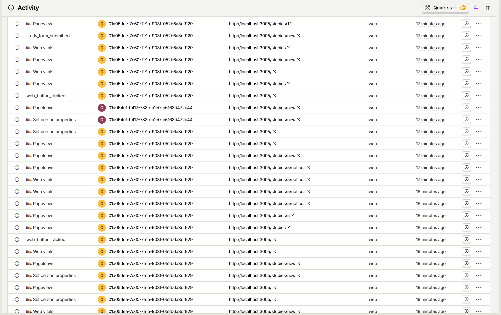
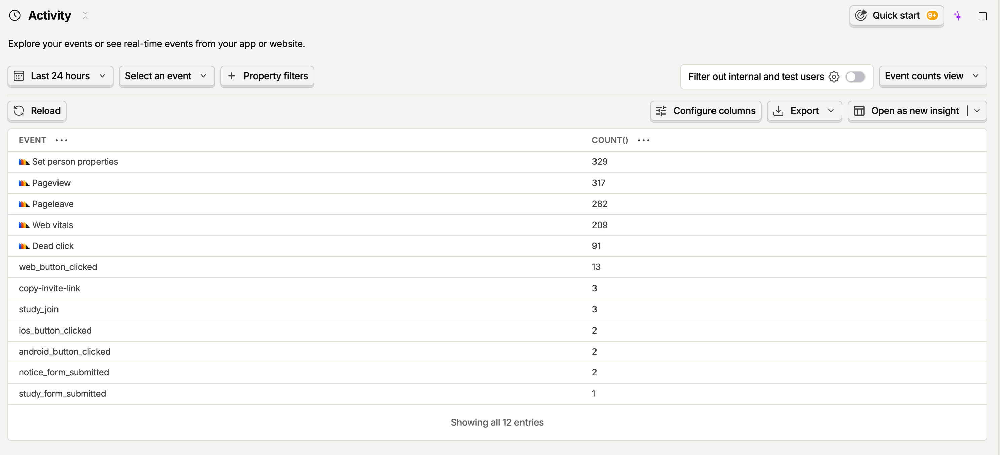

# 사용자 행동 모니터링 환경 구축

## 이유 확인 - 시작 전

> 이 요구사항이 왜 주어졌는지, 어떤 경험을 만들기 위한 것인지 파악합니다.
> **적용 전 상태(문제, 불편, 위험, 비효율, 학습 공백)를 먼저 남깁니다.**

앱을 만들어 나가고 새로운 기능을 추가하면서 매번 하게 되는 고민은 **“실제로 이 기능이 유의미할까”** 이다.

우리가 세운 가정/가설이 일치할까 ?

실제로 사용자들은 우리가 만든 기능들을 잘 사용하고 있을까 ?

아니면 추가한 기능이 존재하는지도 모르거나 그냥 불필요하게 느껴 지나치고 있지는 않을까 ?

만들어 나가는 사람 입장에서 사용자가 **“실제로 사용하는가?”** 에 대해서 의문을 가지게 된다.

그렇다면 실제로 우리가 **“사용자가 앱을 어떻게 사용하는지, 또 사용자가 우리가 추가한 기능을 얼마나 사용하는지”** 를 파악할 수 있다면 좋지 않을까 ?

결국 핵심은, 기능을 개발할때 실제 사용자의 반응을 파악하고 어떤 방향으로 나가아야할지 고민하고 결정하는 것입니다.

## 적용 - 실제 서비스에

> 기술을 학습하고, 실제 팀 프로젝트 서비스에 적용합니다.

### 과정

먼저 이번 프로젝트에서는 Vite를 사용하지 않고 webpack을 사용하기 때문에 직접 구축했다.

그렇기에 webpack에서 진행해야할 추가적인 세팅이 있었다.

패키지 설치 : `pnpm add posthog-js @posthog/react`

환경 변수

```
// 토큰 유출 금지!!
POSTHOG_PROJECT_TOKEN=phc_...
POSTHOG_HOST=https://us.i.posthog.com
```

Webpack에서 `.env` 값을 브라우저 코드에서 `process.env.POSTHOG_*`로 읽을 거면

```tsx
plugins: [
    new webpack.DefinePlugin({
      'process.env.POSTHOG_HOST': JSON.stringify(process.env.POSTHOG_HOST),
      'process.env.POSTHOG_PROJECT_TOKEN': JSON.stringify(
        process.env.POSTHOG_PROJECT_TOKEN,
      ),
    }),
  ],
```

이걸 `webpack.config.ts`에 추가해줘야 한다.

`main.tsx` 에서는 PostHogProvider를 import 해준 후

```tsx
<PostHogProvider
  apiKey={process.env.POSTHOG_PROJECT_TOKEN!}
  options={{
    api_host: process.env.POSTHOG_HOST,
    defaults: "2026-05-30",
  }}
>
  <App />
</PostHogProvider>
```

위와같이 감싸주면 된다 !!

여기서 defaults의 날짜는 PostHog SDK에서 **어떤 기본 설정 세트를 적용할지 지정하는 버전 기준 날짜**이다.

하나의 프로젝트 토큰을 사용하면 개발하는 과정에서 데이터가 오염될 수 있기 때문에 organization을 하나 더 생성 후, `.env.local`, `.env.production` 으로 나누어 서로 다른 토큰을 저장하였다.

`PostHogProvider`로 감싸면 autocapture의 기본값이 true이기 때문에 자동으로 활성화된다.



하지만 모니터링 시 불필요한 데이터까지 쌓이게 되어 필요한 정보들만 뽑아내기에 어려움이 존재한다.

따라서 autocapture 속성을 false로 두고, 직접 이벤트를 심는 방식을 택했다.

클릭 이벤트를 심기 위해선 `usePostHog`를 import한 후 `onClick` 또는 `onSubmit` 핸들러에 아래의 코드만 추가해주면 된다.

```tsx
posthog?.capture("assignment_form_submitted", {
  location: "assignment_create_page",
});
```

‘assignment_form_submitted’는 이벤트 이름이고, location은 이벤트 프로퍼티이다.

location 프로퍼티를 사용하면 추후 필터링하여 동일한 페이지에서 발생한 이벤트만 모아볼 수 있다.

### 도입

Posthog를 프로젝트에 도입했다.

처음에는 핵심 기능들과 상호작용할 수 있는 모든 버튼들에 이벤트를 추가했다.

하지만 “스터디 진행 현황”(과제/공지) 처럼 우리의 가설을 핵심적으로 검증할 부분은 버튼이 아니었다.

그래서 **“특정 부분이 사용자로부터 얼마나 관찰되는가?”** 를 확인하기 위해 `PostHogCaptureOnViewed` 를 관찰할 컴포넌트 주변에 감싸주었다.

이렇게 우리가 관찰하고 싶은 핵심적인 영역과 과제 생성, 과제 제출, 스터디 만들기, 공지 생성과 같은 앱 내 핵심적인 기능들에 이벤트를 추가했다.

해당 이벤트는 우리가 관찰하려고하는 핵심 가설 외에도 **“우리가 가진 핵심 기능들이 얼마나 사용될까?”** 에 대한 호기심으로 부터 관찰하고 해소하려는 마음이 이다.

또한 결국 가장 핵심적인건 **"Posthog를 어떻게 사용하냐"** ? 가 아니라 **"Posthog를 통해 뭘 관찰하려고 하는건지 그리고 그 관찰이 비즈니스적으로 어떠한 목표를 위해서인지를 파악하는 것이다."**

그렇기에 단순히 Posthog 사용방식이 아닌 **"우리는 어떤걸 관찰하려고 하는건가"** **"그리고 그 관찰이 정말로 우리가 생각하는 비즈니스 적인 목표와 연관되어 있는가 ?"** 를 선정하고 검토하는게 중요하다는걸 느꼈다.

#### 예시

우리는 **"알림이 있다면 사용자들은 알림을 통해 연관된 과제/공지들을 확인하게 될것이다"** 라는 가설을 세웠다.

여기서 Posthog를 통해 관찰할때 **"알림 페이지를 얼마나 확인하는지"** 그리고 **"알림 페이지에서 읽지 않은 알림을 클릭하는지"** 와 같은 관찰 데이터는 가설을 해소하는데 적절하지 않다.

사실 적절하지 않다라기 보다는 반쪽자리 아니면 4/1 짜리 해소밖에 되지 않는다.

왜냐하면 실제로 사용자는 **"알림이 있다는 이유만으로 그냥 알림 표시가 거슬려 제거하기 위해 읽지 않은 알림을 클릭했다"** 라는 것도 가능하기 떄문이다.

결국 이런 데이터도 섞이게 되어 세웠던 가설이 잘못된 흐름으로 검증될 수 있다.

그렇기에 조금 더 우리의 목적에 맞게 **"알림 페이지에서 읽지 않은 알림을 클릭하고 연결된 페이지에 x초 동안 체류했다"** 와 같은 데이터를 관찰하면 우리가 해소하려고 하는 목적에 더 알맞은 정보를 얻을 수 있다.

#### 어렵다

posthog를 통한 관찰은 쉽지 않다.

단순히 **"관찰"** 은 쉬운거 같다.

정말 어려운건 **"이 관찰 이 우리의 목적을 해소하는데 정말 도움이 되고 알맞는 관찰 이냐?"** 라는 점이다.

잘못하면 우리는 더럽혀진 정보를 보고 오인된 판단을 할 수 있겠다 라는 생각이 들었다.

그리고 생각보다 그럴 가능성이 높다고 느껴졌다.

그렇기에 posthog를 통해 관찰할때 **"이 데이터를 정말 믿어도 될지"** 생각해야하고 그러기 전에 **"이 데이터가 정말 순수하게 우리의 목적과 알맞는 데이터인지"** 확인해야한다.

## 관찰 - 적용 후

> 적용 후 무엇이 달라졌는지 확인합니다.
> 데이터, 로그, 화면, 대시보드, 팀 피드백, 사용자 반응 등 확인한 것을 남깁니다.


위 사진처럼 모든 이벤트(페이지뷰, 버튼 클릭 등)를 Activity 탭에서 볼 수 있다.

하지만 한눈에 파악하기 어렵다. 따라서 종류별로 나눠 확인할 수 있다.



- Set person properties
  - 사용자의 속성이 설정/변경됐을 때 생기는 이벤트이다.
  - 사용자 ID, 이메일, 플랜, 역할 같은 값을 identify, setPersonProperties 등으로 넣었을 때 발생한다.
- Pageview
  - 사용자가 페이지를 봤을 때 발생한다.
- Pageleave
  - 사용자가 해당 페이지를 떠날 때 발생한다.
- Web vitals
  - 웹 성능 지표를 수집한다. LCP, CLS, INP 같은 Core Web Vitals 관련 성능 데이터를 볼 수 있다
- Dead click
  - 사용자가 클릭했는데 아무 반응이 없는 것처럼 보이는 클릭이다.

## 기록과 설명

> 수행 내용과 판단 근거를 문서로 남깁니다.

가장 먼저 데이터 오염을 고려해 2개의 프로젝트를 만든 후 개발 전용, 프로덕션 전용으로 나누었다.

만약 하나에서 모든걸 파악할 경우 여러 환경에서 관찰된 데이터가 섞이게 된다면 이후 우리는 오염된 데이터로 잘못된 판단을 하게 될거라고 생각했다.

각 환경에 대한 관찰을 분리해야하고 이후에는 특정 사용자별로도 분리해서 관찰해보고 싶다.

관측해야 하는 핵심 데이터는 다음과 같다.

- 랜딩 페이지에서 웹·Android·iOS 진입 버튼의 클릭 수
- 스터디 생성, 초대 링크 복사, 초대 링크를 통한 가입 시도 수
- 공지 생성 및 공지 완독 수
- 과제 생성 및 제출 시도 수
- 과제 제출 현황 노출과 개별 제출물 상세 조회 수

“과제/공지 현황 대시보드는 얼마나 사용자들이 관찰할까?”

앱의 가장 큰 차별점과 장점으로 우리는 “현황을 편하게 확인할 수 있다” 였다.

그렇기에 이 부분을 가장 먼저 확인하고 싶었다.

이외에도 핵심적인 기능들을 최종적으로 수행하는 버튼들에 이벤트를 추가했다.

현재 검증하려는 가설 외에도 우리가 가진 기능중 핵심인 것들이 얼마나 수행되는지에 대해서 관찰하고 싶었다.

지금 처음으로 도입한 단계에서는 “핵심적인 기능들”에 대한 관찰을 위주로 추가했다.

이후에는 우리가 추가로 검증할 가설을 확인할 수 있는 곳에 모니터링 포인터를 둘 예정이다.

또한 타겟별로 관찰 데이터를 측정해 방향성을 결정하는 등으로 데이터를 통해 더 다양한 시도를 해보고 싶다.
